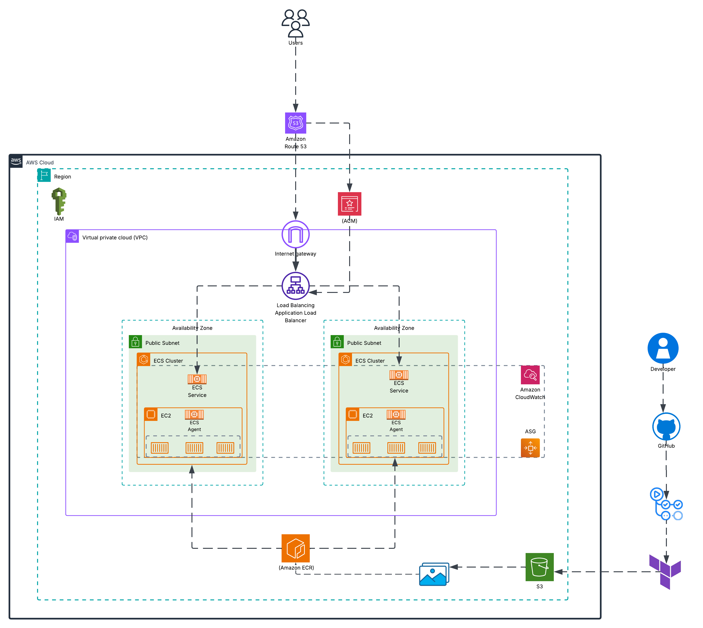

[](https://opensource.org/licenses/MIT)

# Application Deployment with AWS ECS (EC2)


## Table of Contents

- [Introduction](#intro)
- [Project Structure](#project-structure)
- [Features](#features)
- [Architecture](#architecture-diagram)
- [Local Setup](#local-setup)
  - [npm](#npm)
  - [Docker](#docker)
- [Demo](#demo)
- [Future Improvements](#future-improvements)

## Introduction

**Wellness App**

A React-based wellness app I designed and developed. The app allows users to assess their mental health, provides tailored support resources, and integrates with an API to recommend nearby gyms, yoga studios, and running options.

**Deployment**

The Wellness app is deployed on AWS via a fully automated pipeline built with Terraform and GitHub Actions. Infrastructure is defined and managed as code, ensuring security, standardisation, and production readiness. With a fault-tolerant design and minimal manual provisioning, deployments are consistent, efficient, and resilient, reducing operational risk.

## Project Structure
```text
.
├── app
│   ├── build
│   ├── default.conf
│   ├── docker-compose.yml
│   ├── Dockerfile
│   ├── package-lock.json
│   ├── package.json
│   ├── public
│   ├── src
│   └── tailwind.config.js
├── assets
├── README.md
└── terraform
    ├── backend.tf
    ├── main.tf
    ├── modules
    ├── output.tf
    ├── provider.tf
    ├── terraform.tfvars
    └── variables.tf
```

## Features

| Service / Tool           | Purpose                                                                 |
|---------------------------|-------------------------------------------------------------------------|
| **AWS ECS (EC2)**         | Runs containerised workloads on EC2 instances with auto scaling.        |
| **Application Load Balancer (ALB)** | Distributes traffic across tasks in multiple Availability Zones. |
| **Route 53**              | Provides DNS and routes traffic to the ALB.                            |
| **AWS Certificate Manager (ACM)** | Manages TLS certificates to enable secure HTTPS traffic.           |
| **Amazon ECR**            | Stores and versions Docker images for ECS tasks.                       |
| **CloudWatch**            | Collects logs and metrics for observability and monitoring.             |
| **Terraform**             | Infrastructure as Code for provisioning and standardisation.            |
| **GitHub Actions**        | Automates CI/CD for builds, testing, and deployments.                   |


## Architecture Diagram

**Description:**
> The Wellness app is deployed on AWS ECS (EC2 launch type) within a secure, highly available VPC.
> Traffic is routed through Route 53 and distributed by an Application Load Balancer across multiple Availability Zones, ensuring resilience against zone failures.
> ECS tasks run on EC2 instances managed by an Auto Scaling Group, scaling capacity automatically based on demand.
> Container images are stored in Amazon ECR, while logs and metrics are centralised in CloudWatch.
> The whole infrastructure and deployment pipeline is automated end-to-end using Terraform and GitHub Actions

## Local Setup

Clone the repo and move into the `app` directory, then choose either **npm** or **Docker** to run the application locally.  

### `npm`:
Runs in development mode at http://localhost:3000:
```bash
npm install
npm start
```

### `Docker`:
The app runs in a container, accessible at http://localhost:8080:
```bash
docker compose build
docker compose up
```

## Demo
https://github.com/user-attachments/assets/2e0cb02d-8960-4f77-8955-7a06534c9e91


## Future Improvements
**Security**
- Add AWS WAF in front of the ALB: 
I plan to attach a Web ACL to the Application Load Balancer to block malicious traffic before it reaches the app. This adds an extra managed security layer against bad actors.

**Security**
- Move ECS tasks into private subnets: 
Currently, ECS tasks run in public subnets. My goal is to move them into private subnets so they’re never directly exposed to the internet. The ALB will remain public, and tasks will use a NAT Gateway for outbound traffic when required. This reduces the attack surface and keeps container ports hidden.

**Observability**
- Improve observability: 
At the moment, I only have basic ECS logs. I plan to add a CloudWatch dashboard that includes ECS, ALB, and EC2 metrics, along with alarms for health, error rates, and latency. This will improve visibility and help reduce Recovery Time Objective (RTO) during incidents.
